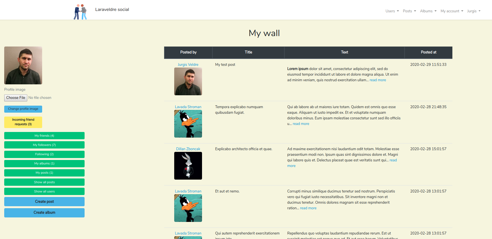
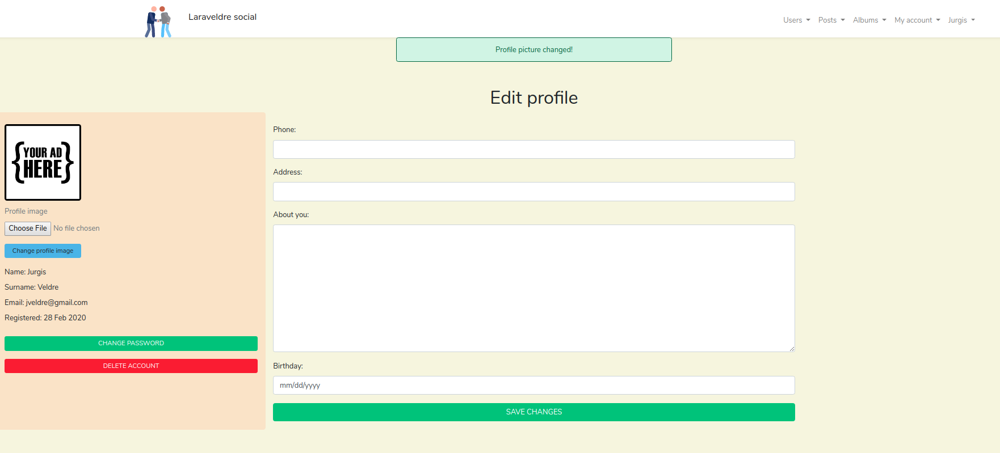
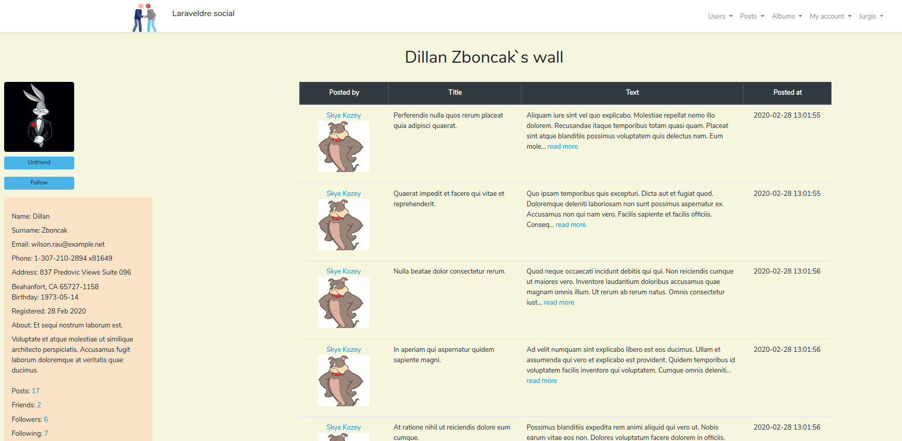
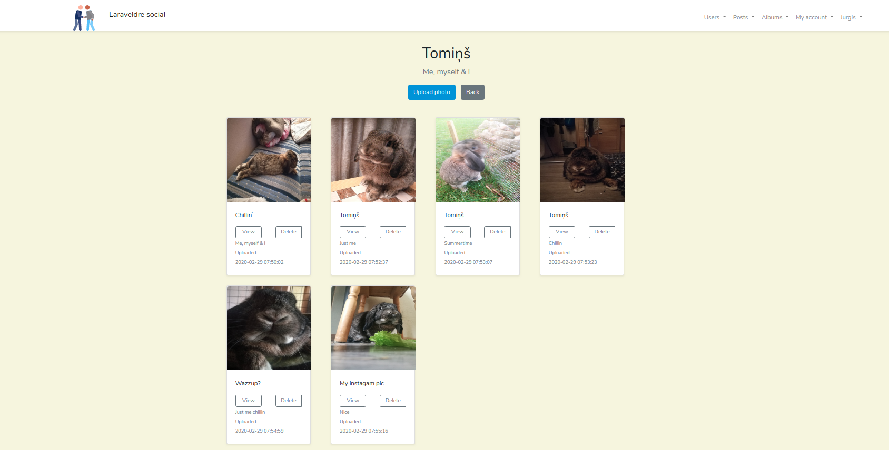
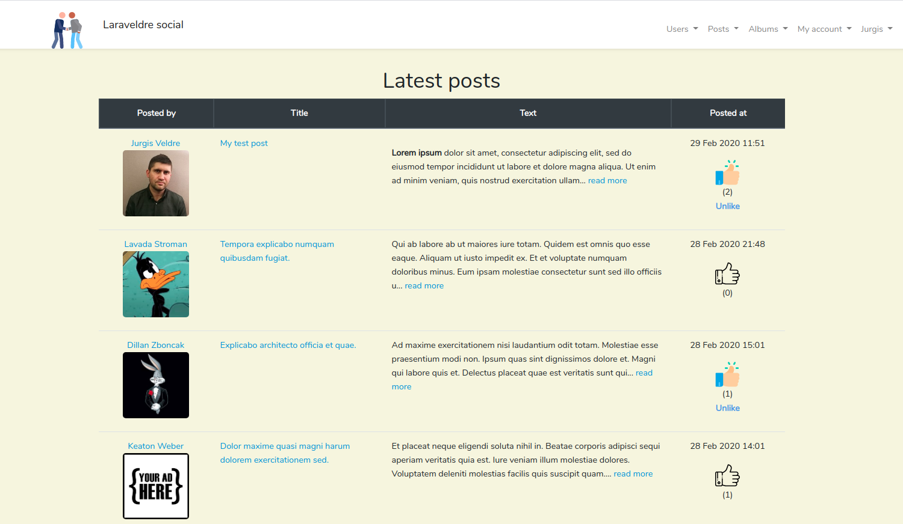

## About Laraveldre social

Laraveldre social is my mini social web-app project. Using PHP 7.2, Laravel 6.15., Composer 1.9.2. Constantly updating, refactoring and adding new features.

## Current features:

## Registration

- Login
Authorization into social network by email and password.
- Password recovery
Password recovery by entering an email where recovery link is sent.
Password can be changed and minimal requirement when changing the password is 8 characters.
- Password change.

## Profile
Option to set/change profile picture.
Option to change/update profile info, such as:

- Phone number
- Address
- Bio
- Birthday

All of this information is displayed in user`s profile view.
Profile link sconsists of SEO friendly readable name (slug) like - /1-john-doe, 2-jane-doe

## Post wall
Users can add new posts to their walls.
Post consists of adding the text, that can be formatted bold, italic, underline etc.
When someone opens persons profile he can see profile information and his posts.
Your post wall consists of your own posts & follower posts.

## Friends
Option to friend request someone.
When accepted you both become each other friends.
Friends should be displayed in each persons profile.
When you become friends you also become followers of each other.
You can follow/unfollow, friend/unfriend person based on your current status of him.
When you unfriend person you also unfollow his content.

## Followers
Followers can see your content (posts) in their feed.
You can follow someone without their permission.

## Stats
For every user (posts, galleries, friends, followers/ followings).

## Picture galleries
Option to create a gallery and add multiple pictures.
Pictures are displayed in the profile.
Everyone can see their pictures.
Option to delete or add new pictures in the gallery after a period of time.

## Currently working on:
- likes;
- search bar;
- comments;
- messaging system between registered users.

## My Linkedin
- https://www.linkedin.com/in/jurgis-veldre/

